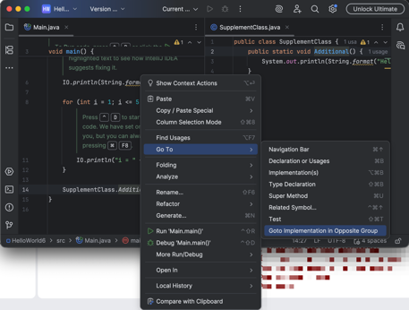

# Goto Implementation in Opposite Group

An IntelliJ Platform plugin that adds a **Goto Implementation in Opposite Group** action — navigate to a symbol's implementation directly in the opposite editor split without leaving your current position.

## Screenshot

## How to Use

1. Place the caret on a symbol whose implementation you want to inspect.
2. Run the action in one of the following ways:
   - **Menu**: <kbd>Navigate</kbd> → <kbd>Goto Implementation in Opposite Group</kbd>
   - **Editor context menu**: Right-click → <kbd>Go To</kbd> → <kbd>Goto Implementation in Opposite Group</kbd>
   - **Search Everywhere**: Press <kbd>Shift</kbd> twice, then type `Goto Implementation in Opposite Group`
   - **Custom shortcut**: Assign one via <kbd>Settings</kbd> → <kbd>Keymap</kbd> → search for `Goto Implementation in Opposite Group`
3. The implementation opens in the opposite editor split with the caret at the target definition.

## Installation

- Using the IDE built-in plugin system:

  <kbd>Settings/Preferences</kbd> > <kbd>Plugins</kbd> > <kbd>Marketplace</kbd> > <kbd>Search for "GoToInOppositeGroup"</kbd> >
  <kbd>Install</kbd>

- Manually:

  Download the [latest release](https://github.com/nadia-tarashkevich/GoToInOppositeGroup/releases/latest) and install it manually using
  <kbd>Settings/Preferences</kbd> > <kbd>Plugins</kbd> > <kbd>⚙️</kbd> > <kbd>Install plugin from disk...</kbd>
